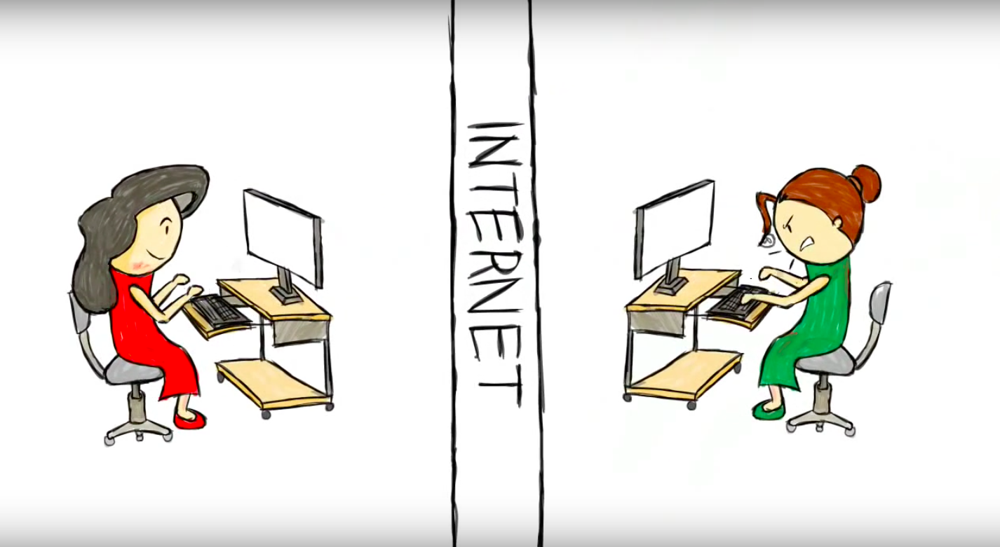

# Level of Impact #1

## Direct effects on people

> At the most basic **level of an impact** approach, we might ask how our methods of data collection **impact humans, directly.** If one is interviewing, or the data is visibly connected to a person, this is easy to see. But a distance principle might help us recognize that when the data is very distant from where it originated, it can seem disconnected from persons, or what some regulators call ‘human subjects.’ ([Annette Markham, "OKCupid data release fiasco: It’s time to rethink ethics education," 2016](http://annettemarkham.com/2016/05/okcupid-data-release-fiasco-its-time-to-rethink-ethics-education/), emphasis added)  

## … But what counts as 'human'? & what 'data' should be off limits?
 
Some commonly blurred definitions:

* “Human subjects”
* Public vs. Private
* Data(Text) vs. Persons

Source: [the 2012 Ethical Decision-Making and Internet Research report by the the AoIR Ethics Working Committee](http://aoir.org/reports/ethics2.pdf)  

## Human subjects & the “distance principle”

A working definition of the “distance principle”:

> **the extent to which Internet texts or data sets might connect to persons”** even when “the conceptual or experiential distance between the researcher and author/participant [does not appear to be] close ([Annette Markam & Elizabeth Buchanon, “Ethical Concerns in Internet Research”](https://www.academia.edu/8037870/Ethical_Concerns_in_Internet_Research), page 10)  

  
Image source: A still image from ["A real person, a lot like you"](https://www.youtube.com/watch?v=cfwwHa-7Ux8) by [Derek Sivers](https://sivers.org/), shared here with his permission.  

******

[<<< Back](levelsimpact.md) - [Next >>>](impact1cont.md)