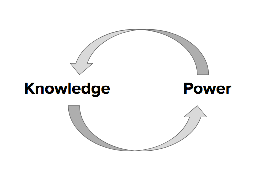

# Level of Impact #2

## Politics of knowledge production

> "At another level, we can ask how our methods of organizing data, analytical interpretations, or findings as shared datasets are being used—or might be used—**to build definitional categories or to profile particular groups** in ways that could impact livelihoods or lives. Are we contributing positive or negative categorizations?" [Annette Markham, "OKCupid data release fiasco: It’s time to rethink ethics education," 2016](http://annettemarkham.com/2016/05/okcupid-data-release-fiasco-its-time-to-rethink-ethics-education/), emphasis added)  

  

## Discuss

Let's discuss as a group:  

* *BRIEFLY,* how are knowledge and power mutually constituted, according to the theorizations of Gramsci, Hall, Foucault, or others?  
* How might we apply the concepts below when thinking through ethics for digital research and projects?  

Some key concepts:  

* **Hegemony** (Antonio Gramsci)  
> “The ability of a dominant group to create [majority] consent and agreement [around a particular system of meanings] within a population without the use or threat of force” (Kenneth Guest, *Cultural Anthropology: A Toolkit for a Global Age*, 2014, page 52)

* **Discourse** (Michel Foucault)  
Discourses are competing ideologies (or individualized groups of statements), constructed by people and institutions in power over time, that become dominant amongst societies of people. Discourses produce knowledge in mediums that a society perceives as normative and generally do not question; in doing so, discourses pervasively shape how the people in that society think, act, and react (see [Michel Foucault, *The Archaeology of Knowledge and the Discourse on Language*, 1969](https://monoskop.org/images/9/90/Foucault_Michel_Archaeology_of_Knowledge.pdf)). 

* **"Policing the crisis"** (Stuart Hall)  
"Policing the crisis" refers to the unnatural process by which certain actions (by certain people) become and continue to be understood, reported, policed, and sanctioned as a type of "crime"; the police, the judicial system, and mainstream media "are actively and continuously part of the whole process" ([Stuart Hall et al., 2013 [1978], Policing the Crisis, page 54](https://colectivociajpp.files.wordpress.com/2012/08/stuart-hall-etc-policing-the-crisis-mugging-the-state-and-law-and-order-critical-social-studies-1978.pdf)). Hall et al. focus on the emergence of "mugging" and its attendant social panic in Britain, beginning in the early 1970s.  

For further readings, see the section "Key works (among many more!) on the politics of knowledge production and forms of knowledge" on the [Resources page](resources.md) of this workshop.  

An example:  

The hegemonic racial discourses that associate Blackness with criminality in the United States serve to justify police brutality towards and higher rates of criminalization and mass incarceration of Black people - and these higher rates of policing and incarcerating serve to justify the assumption of their criminality.

So then when, for eample, someone attempts to make an algorithm to identify potential criminals that is produced through machine learning on "crime" data (e.g. the number of arrests or convictions in relation to demographic data) that algorithm will reproduce the racist ideologies and practices that lead to the policing and incarcerating of Black people at a much higher rate.

Further reading: [Julia Angwen & Jeff Larson, "Bias in Criminal Risk Scores Is Mathematically Inevitable, Researchers Say"](https://www.propublica.org/article/bias-in-criminal-risk-scores-is-mathematically-inevitable-researchers-say)  

## Ramifications of (re)producing categories

Decisions on the categories and boundaries scholars use shape our:

* Datasets
* Archives, catalogues
* Algorithms
* Maps

Categories are key to digital tools in many ways—the organizational systems used by libraries and archives, the tags used on websites, the methods of categorization informing algorithms—which then shapes not only how things/people/etc are grouped together but what is searchable and findable, and the trajectory of canon formation and what is cited and foregrounded.  

> Part of the challenge of understanding algorithmic oppression is to understand that mathematical formulations to drive automated decisions are made by human beings. While we often think of terms such as 'big data' and 'algorithms' as being benign, neutral, or objective, they are anything but. The people who make these decisions hold all types of values, many of which openly promote racism, sexism, and false notions of meritocracy, which is well documented in studies of Silicon Valley and other tech corridors (Safiya Noble, Algorithms of Oppression, 2018, pp. 1-2)  

  
A tweet by Jenna Freedman, shared here with her permission.  
Further reading: [Jenna Freedman, "Library Cataloging and Classification: Reifying the Default," 2018](https://lowereastsidelibrarian.info/talks/2018/moma)  

  
Image source: A comic by Adeline Koh from [#DHPoco: Postcolonial Digital Humanities](http://dhpoco.tumblr.com/), shared here with her permission.  

## Attempts to "resist the hierarchy"  

Some questions to consider:  

* Can categorical hierarchies be resisted through digital projects?  
* If possible, how so?  

## Activity:

Let's analyze and discuss a case study.  

Check out the [Interference Archive (IA) website](http://interferencearchive.org/), read [this brief article](http://technical.ly/brooklyn/2016/11/28/interference-archive-activism-jen-hoyer/%20) and discuss:  

* What kinds of materials does IA host and do they have rights to it?
* In reference to the article, how does IA see itself as “resisting the hierarchy”?
* What levels of impact does IA aim to take into account?

*Fun fact: I helped paint that #NoDAPL banner - with others at [Decolonize this Place](http://www.decolonizethisplace.org/) - shown in the article's first photo.*

Additional projects to check out:  
* The [#StandingRockSyllabus](https://nycstandswithstandingrock.wordpress.com/standingrocksyllabus/)  
* The [Zine Librarians Code of Ethics](http://zinelibraries.info/code-of-ethics/)  

******

[<<< Back](impact1cont.md) - [Next >>>](impact3.md)